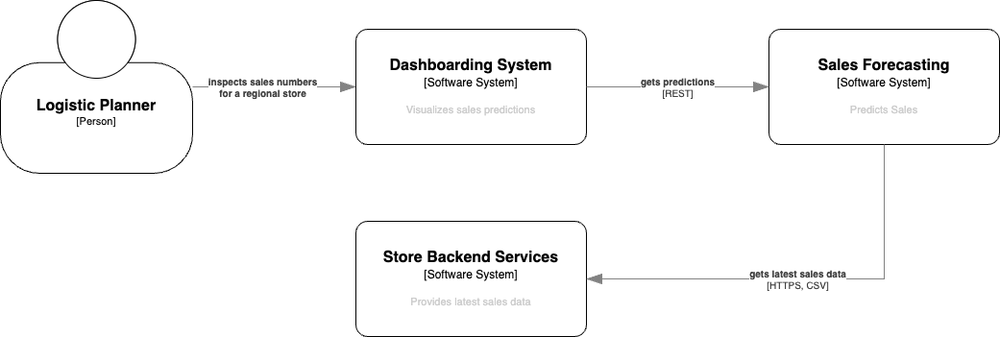
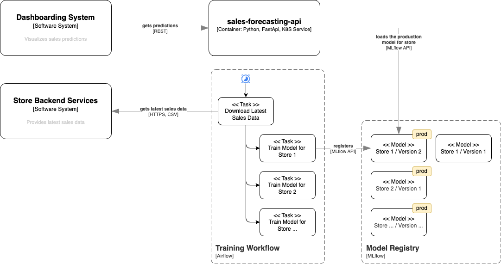

# AIS DEV2IL - MLOps - Sales Forecasting

This is an example project used in the exercise course of the DEV2IL lecture. It implements the online predication high level ML system design and uses the Train-Persist training system option.

## Business Problem

You work for the logistics arm of a large retail chain. The company wants to help regional logistics planners get ahead of busy periods and avoid sell-outs. They therefore want to provide the planners a web based dashboard, where they can predict sales for a chosen period of time. This helps them to understand likely future demand profiles before they make orders.

### User Story: Predict Sales Numbers for a Regional Store

As a logistic planner, I want to get predictions for sales of my regional store in order avoid sell-outs. 

Acceptance Criteria
- The predicted sales for a single, regional store are displayed for a selected time span

## High Level System Architecture

After some discussions with the developers of the store's backend services, you agree on the following integration architecture: 
- Latest sales data for all stores for the last 2 years is made available for download
- Sales data is provided in CSV format with the following structure

| Column Name | Description |
|-------------|-------------|
| `Store`     | The identifier of the store |
| `Date`      | Date in the format YYYY-MM-DD |
| `Sales`     | Number of products sold on the given day |
| `Open`      | 1 if the store was open on the given day, 0 otherwise |

- The dashboarding system is going to fetch predictions from a REST API as defined in this example

`GET http://{host}/store/{store id}/predictions?dates=2025-05-01,2025-05-02,2025-05-03`





## Sales Forecasting Architecture

As the data shows, that sales depend on the store and that customer behaviors changes with time, you decide to
- train a model per store
- re-train each store's model on a weekly basis 





## Setup

```
# Create and activate a virtual environment
python -m venv .venv
source .venv/bin/activate

# Install runtime requirements and add project in edit mode
pip install -e .
# Install development and test requirements
pip install .[dev]
pip install .[test]
```

## Notebook environment

Run `jupyter notebook` to work with the notebooks without IDE.

When using an IDE, make sure that the IDE is configured to use the project's virtual environment and that that the notebook working directory is the directory where the notebook files is located.

## Testing 

Run `pytest`.
In order to see logging and stdout outputs, use `pytest -s --log-cli-level=DEBUG`.

## Run the MLflow Tracking Server

1. Start the MLflow server using `kubectl apply -f deploy/mlflow`
1. `kubectl port-forward service/mlflow-server-service 5000:5000`
1. You can reach the tracking server at http://127.0.0.1:5000

## Train a Store Model Locally 

1. `download-latest-sales-data ./work`
1. `train-store-model ./work 1 --mlflow-tracking-uri http://localhost:5000`
1. `train-store-model ./work 4 --mlflow-tracking-uri http://localhost:5000`

You can now inspec the runs and find the model at http://127.0.0.1:5000

## Orchestrate Store Model Training via Airflow

1. Make sure that the Mlflow Tracking Server is running
1. `kubectl apply -f deploy/airflow`
1. Get the `admin` password via `kubectl logs -f airflow`
1. `kubectl port-forward service/airflow-service 8080:8080`
1. Login at http://localhost:8080 (`admin` / password as obtained from the logs)


## Serve a Store Model using Mlflow 

1. Run the API server `mlflow models serve -m models:/sales-forecaster-store-4/latest --env-manager local -p 5001`
1. Request predictions
```
curl -X POST http://127.0.0.1:5001/invocations \
-H "Content-Type: application/json" \
-d '{
  "dataframe_split": {
    "columns": ["ds"],
    "data": [
      ["2025-05-01"],
      ["2025-05-02"],
      ["2025-05-03"]
    ]
  }
}'
```

## Make Predictions using the `sales-forecasting-api` Server

1. Make sure that the Mlflow Tracking Server is running

### Run the server in development mode

1. Run the API server in development mode: `fastapi dev sales_forecasting/api.py`
1. Go to http://localhost:8000/docs 

### Run the server as K8S service

1. `kubectl apply -f deploy/k8s/sales-forecasting-api.yaml`
1. Forward the port 


# ais-dev2il-mlops-sales-forecasting


- train a model per store 
- save the model incl. metrics in ml flow
- publish the model if it meets certain criteria
- provide the predictions per store through an API server

Airflow for training per store (dynamic based on data)
MLFlow tracking server and model registry
Fast API


docker pull ghcr.io/mlflow/mlflow:v2.22.0


https://github.com/PacktPublishing/Machine-Learning-Engineering-with-Python-Second-Edition/blob/main/Chapter08/train/train_forecasters_simplified.py


1. explain the use case and dataset
1. go through the notebook